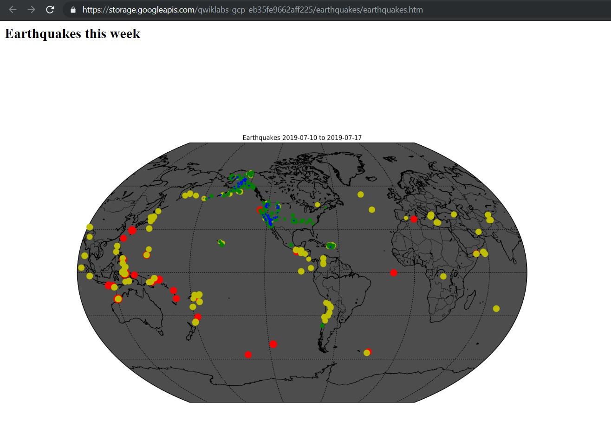

# Using a VM to process earthquake data on GCP

This project is to ingest real-time earthquake data published by the United States Geological Survey (USGS) and create maps to display it.

The main goal of this project was to spin up a virtual machine, configure its security, access it remotely, and then carry out the steps of an ingest-transform-and-publish data pipeline on [GCP](https://cloud.google.com/).

Following were the steps involved:
1. I created a Compute Engine instance with the necessary Access and Security
2. SSH into the instance to remotely access the Compute Engine
3. Installed the software package Git
4. Ingested data into the Compute Engine instance from cloned repository on Github
5. Transformed data on the Compute Engine instance to process the raw data into a map of earthquake
6. Stored the transformed data on Cloud Storage by creating a bucket
7. Published Cloud Storage data to the web to make it easily accessible to view the result

[Here](./basemap/earthquakes.ipynb) is the notebook that process that data and plots the earthquakes on the map

The following image shows the earthquakes occurred in a week:

